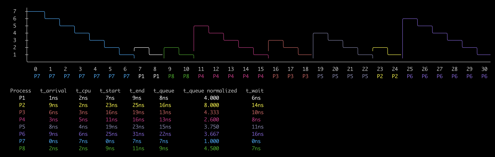
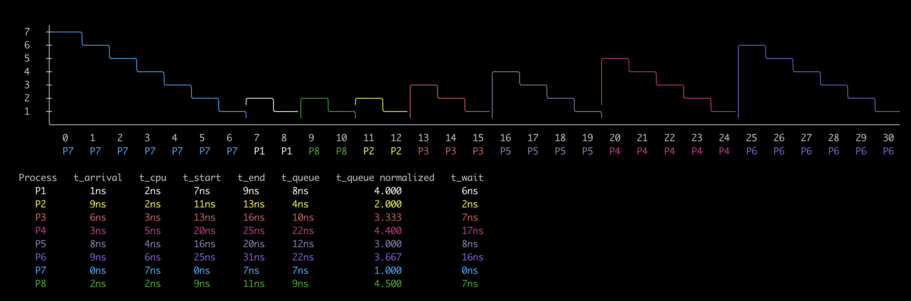
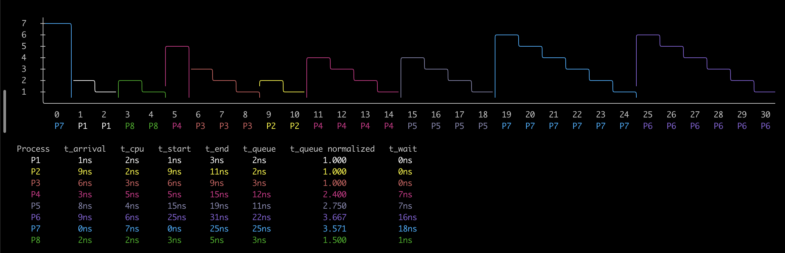
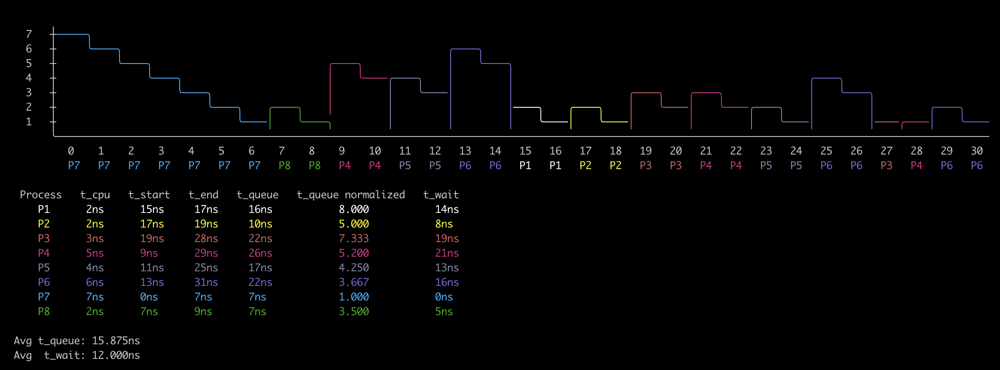

# Process Planning Visualizer:

A simple way to visualize how the different implementations handle a set of processes.
It graphs in the console a colorful line bar with the use of the different processes.

## Installation:
    git clone --recursive git@github.com:Jkutkut/PY-Process_Planner_Visualizer.git

### FCFS:

### SJF:

### SRJF:

### RR:

